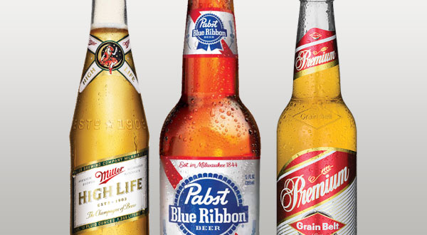

# 1B American Lager

|Estatísticas Vitais      |Mínimo  | Máximo |
|:------------------------|:------:|:------:|
| Densidade Original (OG) |1.040   |1.050   |
| Densidade Final (OG)    |1.004   |1.010   |
| Cor (SRM)               |2       |4       |
| Amargor (IBU)           |8       |18      |
| Álcool (ABV) %          |4,2     |5,3     |

## Impressão Geral

```
Uma lager muito clara, altamente carbonatada, de corpo leve e bem atenuada, com um perfil de sabor muito 
neutro e de baixo amargor. Servidas bem geladas, elas podem ser muito refrescantes e saciadoras de sede.
```

## Aroma

```
Baixo a nenhum aroma de malte, que, se presente, pode ser percebido com caráter de grãos pouco doces ou milho. 
Aroma de lúpulo muito leve a nenhum, com uma presença condimentada ou floral. Embora um caráter de fermentação 
limpa seja desejável, algumas características de levedura (particularmente um ligeiro frutado maçã) não é uma
falha. Um leve DMS não chega a ser uma falha.
```

## Aparência

```
Cor amarelo pálido a amarelo médio. Colarinho de espuma branca que raramente persiste. Muito límpida.
```

## Sabor

```
Relativamente neutra no palato com um final seco e fresco, com baixo a moderado-baixo sabor de grãos ou de
milho, o que pode ser percebido como dulçor, devido ao baixo amargor. Sabor de lúpulo baixo a moderadamente 
baixo, que pode ter uma qualidade floral, picante (condimentada) e herbal (embora raramente forte o suficiente 
para ser distinguido). O amargor do lúpulo é baixo para médio-baixo.
O equilíbrio pode variar de ligeiramente maltado a ligeiramente amargo, mas é relativamente equilibrada. 
O alto nível de carbonatação pode acentuar o frescor de um final seco. Caráter limpo de uma fermentação lager.
```

## Sensação na Boca

```
Corpo leve a médio-baixo. 
Altamente carbonatada, com uma picância de gás carbônico que provoca ligeira coceira na língua.
```

## Comentários

```
Sabores fortes é uma falha. Em geral, são as cervejas que os bebedores de cerveja artesanal não esperam receber 
quando pedem uma cerveja nos EUA. Pode ser comercializada como Pilsner fora da Europa, mas não deve ser confundida 
com exemplares tradicionais.
```

## História

```
Apesar de, nos EUA, os imigrantes alemães produzirem lagers inspirados por Pilsner tradicionais desde meados da década
de 1800, o estilo moderno de American Lager foi fortemente influenciado pela proibição e a Segunda Guerra Mundial. 
As cervejarias sobreviventes consolidam, expandiram-se e promoveram fortemente um estilo de cerveja que caiu no gosto 
de uma grande parte da população. 
Durante décadas foi o estilo dominante de cerveja e, por isso, surgiram muitas cervejarias rivais internacionais, que 
começaram a desenvolver produtos semelhantes para o mercado de massa, com apoio em campanhas publicitárias agressivas.
```

## Ingredientes Característicos

```
Malte de cevada de duas ou seis fileiras, com uma percentagem elevada (acima de 40%) de arroz ou milho como adjuntos.
```

## Exemplos Comerciais



