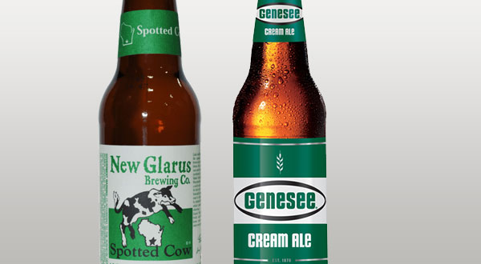

# 1B Cream Ale

|Estatísticas Vitais      |Mínimo  | Máximo |
|:------------------------|:------:|:------:|
| Densidade Original (OG) |1.042   |1.055   |
| Densidade Final (OG)    |1.006   |1.012   |
| Cor (SRM)               |2.5     |5       |
| Amargor (IBU)           |8       |20      |
| Álcool (ABV) %          |4,2     |5,6     |

## Impressão Geral

```
Uma cerveja americana limpa, bem-atenuada e saborosa, tipicamente para se refrescar "enquanto se corta a 
grama no jardim." Fácil de beber e refrescante, mas com mais corpo do que as típicas lagers americanas.
```

## Aroma

```
Notas de malte de média a médio-baixa intensidade, com um aroma doce semelhante ao milho. Estão permitidos 
baixos níveis de DMS, mas não são necessários. Aroma de lúpulo de médio- baixo a nenhum, e que, se presente, 
pode ser de qualquer variedade, entretanto, notas florais, condimentadas ou herbais são os mais comuns. 
Em suma, um aroma sutil, em que não domina nem o malte nem o lúpulo. Baixos ésteres de frutas são opcionais.
```

## Aparência

```
Cor amarelo palha a moderado ouro, mas normalmente mais claras. Colarinho de espuma de baixa a média formação, 
com carbonatação média a alta e retenção razoável. Brilhante e cristalina, com muitos reflexos.
```

## Sabor

```
Baixo a médio-baixo amargor de lúpulo. Baixa a moderada maltosidade e dulçor, variando com a densidade e a atenuação. 
Geralmente bem atenuadas. Nem malte nem lúpulo dominam o paladar. Baixo a moderado sabor de milho é normalmente 
encontrado como um leve DMS (opcional). O final pode variar entre um pouco seco e ligeiramente doce. Ésteres baixos 
de frutas são opcionais. 
Baixo a médio-baixo sabor de lúpulo (de qualquer variedade, mas geralmente floral, condimentado, ou de ervas).
```

## Sensação na Boca

```
Geralmente leve e fresca, mas o corpo pode chegar a ser médio. Sensação na boca suave, com atenuação média a alta; 
níveis mais elevados de atenuação podem ser pretendidos para obter maior perfil de "matar a sede". Alta carbonatação.
```

## Comentários

```
As Cream Ale Pre-Prohibition eram ligeiramente mais forte, lupuladas (incluindo versões com dry hopping) e mais 
amargas (25-30 + IBU). Essas versões devem ser registradas na categoria histórica (Historical Beer). A maioria 
dos exemplos comerciais apresenta densidade inicial (OG) na faixa de 1050-1053 e o amargor raramente excede a 30 IBUs
```

## História

```
Uma ale mais espumante ou de consumo fresco que existia nos anos 1800 e que sobreviveu à Lei Seca. Uma versão ale 
do estilo lager americano produzido por fabricantes de cerveja ale para competir com fabricantes de cerveja lager 
no Canadá e nos Estados do Nordeste, Meio-Atlântico e Centro-Oeste dos EUA. Originalmente conhecida como uma ale 
espumante ou de consumo in natura, foram utilizadas algumas cepas de leveduras lager (e às vezes ainda são) por 
alguns fabricantes de cerveja, mas historicamente não estavam misturadas, feitas apenas com cepas ale. 
Muitos exemplos usam o método de Kräusen para elevar a carbonatação. O armazenamento a frio não é tradicional, 
entretanto alguns cervejeiros atualmente estão assim procedendo.
```

## Ingredientes Característicos

```
Ingredientes americanos comumente usados, receitas de grãos integrais com maltes seis fileiras, ou uma combinação 
de maltes seis fileiras e duas fileiras americanas. Os adjuntos podem chegar a até 20% de milho na mosturação e 
20% de glicose ou outros açúcares na etapa de fervura. Qualquer variedade de lúpulo pode ser usada para amargor 
e aroma.
```

## Exemplos Comerciais



