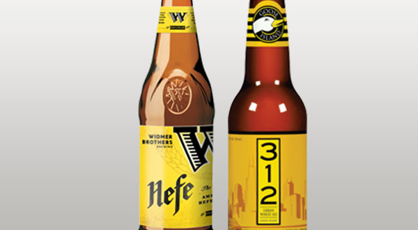

# 1B American Wheat Beer

|Estatísticas Vitais      |Mínimo  | Máximo |
|:------------------------|:------:|:------:|
| Densidade Original (OG) |1.040   |1.055   |
| Densidade Final (OG)    |1.008   |1.013   |
| Cor (SRM)               |3	   |6       |
| Amargor (IBU)           |15      |30      |
| Álcool (ABV) %          |4,0     |5,5     |

## Impressão Geral

```
Cerveja refrescante de trigo mostrando mais presença de lúpulo e menos características de levedura do que 
os seus exemplares de cerveja de trigo alemães. Um caráter de fermentação limpo permite que os sabores de 
trigo, na forma de pão, massa ou grãos sejam complementados mais pelo sabor e amargor de lúpulo que pelas 
características do fermento.
```

## Aroma

```
Caráter baixo a moderado de trigo, grão, pão ou massa. Um dulçor leve a moderado, maltado, é aceitável. 
Os ésteres podem ser moderados a ausentes, embora devam refletir cepas de leveduras relativamente neutras; 
notas de banana são inadequadas. O aroma de lúpulo pode ser baixo a moderado e pode ter notas cítricas, 
condimentadas, florais ou de frutas. Não podem estar presentes notas fenólicas de cravo.
```

## Aparência

```
Normalmente amarelo pálido ao dourado. A transparência pode variar de brilhante a turva em razão da presença 
de fermento, a aproximar-se do estilo alemão Weissbier. 
Há grande formação de espuma branca, de longa persistência.
```

## Sabor

```
Leve a moderadamente forte sabor de trigo, pão, massa ou grãos que dura até o fim. Pode ter um dulçor maltado 
moderado e terminar bastante seco. Baixo a moderado amargor de lúpulo, que às vezes persiste até o final. 
O amargor e o dulçor são normalmente equilibrados, mas tende para o amargo. Baixo a moderado sabor de lúpulo 
(cítrico, condimentado, floral ou frutado). Ésteres podem ter presença de intensidade moderada a ausente, mas 
não devem incluir notas de banana nem cravo (fenóis). O final pode ser ligeiramente crisp.
```

## Sensação na Boca

```
Corpo médio-baixo a médio. Carbonatação médio-alta para alta. Leve cremosidade é opcional; cervejas de trigo, 
por vezes, têm uma impressão "fofa" e macia.
```

## Comentários

```
Há diferentes variações, desde cervejas muito fáceis de tomar, ligeiramente doces, a cervejas secas e agressivamente 
lupuladas com um forte sabor de trigo. 
Cervejas de centeio devem ser registradas na categoria de Specialty Type Alternative Fermentable.
```

## História

```
Originalmente, uma adaptação ao estilo alemão Weissbier usando uma levedura limpa e lúpulo, feita por cervejarias 
artesanais americanas. Este estilo foi amplamente popularizado por Widmer, em meados dos anos 80.
```

## Ingredientes Característicos

```
Fermento americano limpo, ale ou lager (emprego de levedura de Weissbier alemã é inadequado). 
Uma grande proporção de malte de trigo (geralmente 30-50%), o qual é menor do que numa típica Weissbier alemã. 
Os lúpulos são americanos típicos, alemães ou do Novo Mundo.
```

## Exemplos Comerciais


