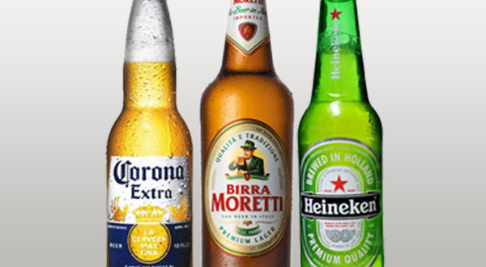

# 2A International Pale Lager

|Estatísticas Vitais      |Mínimo  | Máximo |
|:------------------------|:------:|:------:|
| Densidade Original (OG) |1.042   |1.050   |
| Densidade Final (OG)    |1.008   |1.012   |
| Cor (SRM)               |2       |6       |
| Amargor (IBU)           |18      |25      |
| Álcool (ABV) %          |4,6     |6,0     |

## Impressão Geral

```
Uma cerveja lager clara muito atenuada, sem sabores fortes, tipicamente bem equilibrada e altamente carbonatada. 
Servidas geladas, elas são saciadoras de sede e refrescantes.
```

## Aroma

```
Baixo a médio-baixo aroma de malte, e que pode ser um pouco de grãos ou ligeiramente doce de milho. 
Aroma de lúpulo pode ser muito baixo a médio, com presença condimentada ou floral. Embora geralmente um perfil de 
fermentação limpa seja desejado, baixos níveis de características de levedura (como uma leve nota frutada de maçã) 
não são uma falha. Uma pequena quantidade de DMS ou aroma de milho não é uma falha.
```

## Aparência

```
Amarelo-palha ao ouro na cor. Colarinho branco que não pode durar muito tempo. Muito límpida.
```

## Sabor

```
Nível baixo a moderado de maltosidade como a grãos, com um final fresco, seco, e bem atenuado. 
O caráter de grãos pode ser neutro ou mostrar qualidades suaves de pão e biscoitos, e até mesmo 
um nível moderado de sabores de milho ou dulçor do malte. Os sabores de lúpulo variam de ausentes 
a médios, muitas vezes mostrando um caráter floral, condimentado ou herbal se estiver presente. 
Lúpulo de amargor médio-baixo a médio. 
O equilíbrio pode variar de ligeiramente maltado a ligeiramente amargo, mas é relativamente equilibrada. 
Retrogosto neutro com malte suave e, às vezes, sabores de lúpulo. 
Uma leve quantidade de DMS não é uma falha.
```

## Sensação na Boca

```
Corpo leve a médio. Moderadamente alta a alta carbonatação. 
Leve toque carbônico pode ser sentido na língua.
```

## Comentários

```
As International Lager tendem a ter menos adjuntos que o padrão das American Lager e podem ser puro malte, 
mas os sabores fortes permanecem a ser uma falta. É bastante ampla a categoria de Lagers do mercado de massa que
variam de cervejas de alto nível do estilo American Lagers às típicas cervejas internacionais de "importação" ou
"garrafa verde" que podem ser encontrados em muitos mercados de exportação e nos EUA. 
Muitas vezes são rotuladas como "Pilsner", o que gera confusão.  Qualquer aroma de “gambá” na cerveja de garrafa 
verde comercial provém de reação fotoquímica dos compostos provenientes do lúpulo com raios UV (lightstruck) 
devido ao mau armazenamento da garrafa e não é uma característica do estilo.
```

## História

```
Nos EUA foram desenvolvidas como uma versão premium do padrão American Lager, com uma história similar. 
Fora dos EUA, elas desenvolveram como uma imitação do estilo American Lager ou uma versão mais acessível 
(geralmente mais seca e menos amarga) de uma cerveja do estilo Pilsner. 
Elas são frequentemente acompanhadas por campanhas publicitárias fortes e são exportadas pelas cervejarias 
industriais ou multinacionais.
```

## Ingredientes Característicos

```
Malte de cevada de duas ou seis fileiras. 
É possível utilizar arroz, milho ou açúcar como adjuntos ou pode ser puro malte.
```

## Exemplos Comerciais


