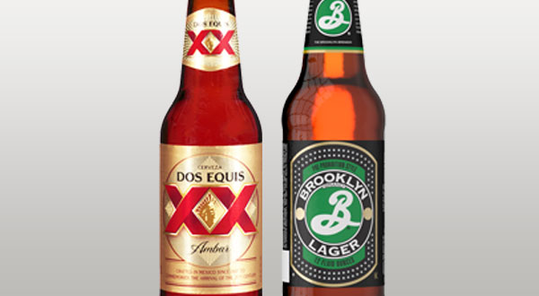

# 2B International Amber Lager

|Estatísticas Vitais      |Mínimo  | Máximo |
|:------------------------|:------:|:------:|
| Densidade Original (OG) |1.042   |1.055   |
| Densidade Final (OG)    |1.008   |1.014   |
| Cor (SRM)               |7       |14      |
| Amargor (IBU)           |8       |25      |
| Álcool (ABV) %          |4,6     |6,0     |

## Impressão Geral

```
Uma lager âmbar, bem atenuada e maltada, com uma interessante qualidade de caramelo ou tostado e com 
amargor retraído. Normalmente muito atenuada, muitas vezes com emprego de adjuntos. 
Suave, com a característica lager de alta drinkability.
```

## Aroma

```
Baixo a moderado aroma de malte pode remeter a grãos, com muito baixo a moderado dulçor de malte caramelo 
ou malte tostado. O aroma de lúpulo pode variar de baixo a nenhum, com um leve caráter floral ou condimentado. 
Ela tem um perfil lager limpo. Um aroma fraco de milho ou DMS é aceitável.
```

## Aparência

```
Cor âmbar-dourado a cobre avermelhado. Cristalina e brilhante. Colarinho branco a marfim, de baixa retenção.
```

## Sabor

```
Perfil de malte baixo a moderado que pode variar desde seco para grãos doces. Baixos a moderados níveis de 
caramelo e pão tostado podem ser evidentes. Baixo a médio-baixo dulçor de milho é opcional, mas não um defeito. 
O amargor do lúpulo é baixo a moderado, assim como o sabor, que apresenta um caráter condimentado, floral ou herbal. 
O equilíbrio pode ser de bastante maltado a quase equilibrado, com o amargor sendo mais perceptível, mas não desagradável. 
O nível de amargor pode aumentar se o caráter de malte aumentar para buscar o equilíbrio. Perfil de fermentação limpo. 
O final é moderadamente seco com um sabor maltado moderado.
```

## Sensação na Boca

```
Corpo leve a médio. Média a alta carbonatação. Suave, alguns exemplares podem ser cremosos.
```

## Comentários

```
Um amplo espectro de consumidores de Amber Lagers de consumo em massa foi desenvolvido, de forma independente, 
em vários países, identificando-se com cervejas de tom âmbar, genéricas, que talvez tivessem mais significado 
histórico, mas eventualmente mudaram para produtos atualmente pouco distinguíveis.
```

## História

```
Ela varia de país para país, mas geralmente representa uma adaptação da International Lager de consumo de massa 
ou uma evolução de estilos autóctones de um produto mais genérico.
```

## Ingredientes Característicos

```
Base de maltes de duas ou seis fileiras. Maltes especiais de cor como Victory (ou Melanoidina, Amber, etc). 
Adjuntos, além de malte caramelo. Lúpulos europeus, americanos ou uma combinação de ambos.
```

## Exemplos Comerciais


