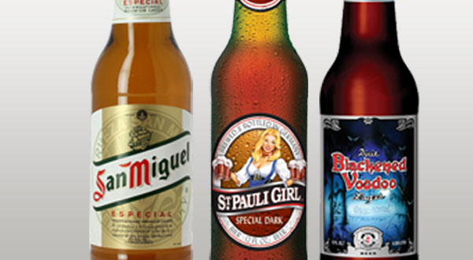

# 2C International Dark Lager

|Estatísticas Vitais      |Mínimo  | Máximo |
|:------------------------|:------:|:------:|
| Densidade Original (OG) |1.042   |1.056   |
| Densidade Final (OG)    |1.008   |1.012   |
| Cor (SRM)               |14      |22      |
| Amargor (IBU)           |8       |20      |
| Álcool (ABV) %          |4,2     |6,0     |

## Impressão Geral

```
Uma versão mais escura e, talvez, mais doce da International Pale Lager com um pouco mais de corpo e sabor, 
mas igualmente com amargor restringido. O baixo amargor deixa o malte como elemento de sabor primário, e os 
baixos níveis de lúpulo contribuem pouco ao equilíbrio geral.
```

## Aroma

```
Baixo a nenhum aroma de malte, pode ter uma leve nota de milho. Médio- baixo ou nenhum aroma de malte tostado
e caramelo. O aroma de lúpulo pode variar de ausente a suave, com uma presença condimentada ou floral. 
Enquanto um perfil de fermentação limpa é geralmente desejado, baixos níveis de características de levedura 
(como um baixo frutado de maçã) não são uma falha. 
Uma pequena quantidade de DMS ou cheiro de milho não é considerado uma falha.

```

## Aparência

```
Cor âmbar profundo a marrom escuro, transparente, brilhante e com reflexos vermelho rubi. 
Colarinho bege a marrom claro que pode não perdurar.
```

## Sabor

```
Dulçor de malte baixo a médio, com sabores de malte caramelo e/ou torrado de médio-baixo a nenhum 
(que podem incluir notas de café, melaço ou de cacau). O sabor de lúpulo varia de nenhum a baixo e 
é normalmente floral, condimentado ou herbal. O amargor do lúpulo é de baixo a médio. 
Pode ter uma leve frutosidade. Final moderadamente fresco. O equilíbrio é normalmente um pouco maltado. 
Os sabores de malte queimado ou com um torrado moderadamente forte é um defeito.
```

## Sensação na Boca

```
Corpo leve a médio- baixo. Suave com uma leve cremosidade. Média a alta carbonatação.
```

## Comentários

```
Uma grande variedade de cervejas internacionais que são mais escuras do que claras, e que não 
apresentam notas assertivamente amargas e/ou torradas.
```

## História

```
São versões mais escuras da International Pale Lager, frequentemente criadas pelas mesmas cervejarias 
industriais, com a intenção de apelar a um público mais vasto. Muitas vezes, uma adaptação mais colorida 
ou adoçada de uma Pale Lager industrial, ou uma versão mais acessível (e mais barata) das lagers escuras 
tradicionais.
```

## Ingredientes Característicos

```
Maltes de duas ou seis fileiras, milho, arroz ou açúcar como adjuntos. 
Uso moderado de caramelo e maltes escuros. Versões comerciais usam corantes.
```

## Exemplos Comerciais


